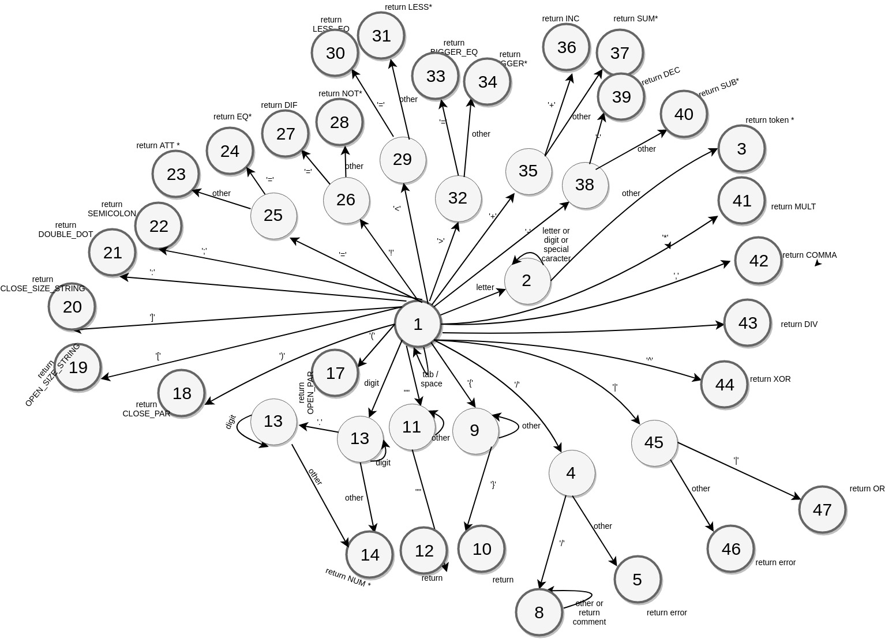

# MorcelaLang

Versão 2018

*Elixandre Michael Baldi*

*Luiz Guilherme Fonseca Rosa*

## Nome

Lê-se ‘murcilia’, é um embutido feito de sangue e vísceras, geralmente do porco, com confecção tradicional nos sítios do estado do Rio Grande do Sul, estado esse que compreende a descendência dos criadores da linguagem.

## Características

Em questões estruturais, a MorcelaLang é baseada em Pascal, pois as variáveis e escopos são separadas por seções, de forma que as variáveis são todas globais.

Ao final de cada linha deverá aparecer o ponto e vírgula (;).

Como estruturas de repetição, há o `WHILE` (verIFica condição antes de executar o procedimento) e o `DO WHILE` (verIFica condição depois de executar o procedimento).

Têm-se, também, o seguintes recursos: `IF`, `WHILE`, `DO WHILE` e `SWITCH CASE` e os seguintes tipos primitivos: `STRING`, `DOUBLE` e `BOOLEAN`.

A linguagem é indicada para uso de iniciantes em programação, pois os recursos são limitados, mas, ao mesmo tempo, permite explorar o básico de uma linguagem de programação.

## Operadores Aritméticos

As operações descritas abaixo resultarão em valores atribuídos num endereço temporário, podendo ser atribuído num endereço de um identIFicador posteriormente.

### Soma

Sintaxe:

```
operando1 + operando2 + … + operandoN;
```

Semântica:

Independente da quantidade de operandos na soma, a ordem sempre será da esquerda para a direita, ou seja, inicialmente o primeiro operando é armazenado no endereço temporário, e então o endereço temporário recebe o acúmulo da operação com o próximo operando até acabar.

Os operandos 1 e 2 podem ser tanto um identificador quanto um valor imediato.

### Subtração

Sintaxe:

```
operando1 - operando2 - … - operandoN;
```

Semântica:

Independente da quantidade de operandos na subtração a ordem sempre será da esquerda para a direita, ou seja, inicialmente o primeiro operando é armazenado no endereço temporário, e então o endereço temporário recebe o acúmulo da operação com o próximo operando até acabar.

Os operandos 1 e 2 podem ser tanto um identificador quanto um valor imediato.

### Multiplicação

Sintaxe:

```
operando1 * operando2 * … * operandoN;
```

Semântica:

Independente da quantidade de operandos na multiplicação a ordem sempre será da esquerda para a direita, ou seja, inicialmente o primeiro operando é armazenado no endereço temporário, e então o endereço temporário recebe o acúmulo da operação com o próximo operando até acabar.

Os operandos 1 e 2 podem ser tanto um identificador quanto um valor imediato.

### Divisão

Sintaxe:

```
operando1 / operando2 / … / operandoN;
```

Semântica:

Independente da quantidade de operandos na divisão a ordem sempre será da esquerda para a direita, ou seja, inicialmente o primeiro operando é armazenado no endereço temporário, e então o endereço temporário recebe o acúmulo da operação com o próximo operando até acabar.

Os operandos 1 e 2 podem ser tanto variáveis (endereço de valor em memória) quanto um valor direto (literal).

## Operadores Lógicos

Para a realizar operações com operadores lógicos é necessário que todas os operandos sejam do tipo `BOOLEAN`.

Vale lembrar que temos o tipo primitivo BOOLEANo e qualquer expressão relacional ou lógica armazena o resultado em um endereço temporário (identificador). O resultado da operação lógica também é armazenado num endereço temporário.

### And

Sintaxe:

```
operando1 && operando2;
```

Semântica:

O resultado proveniente desta operação seguirá as regras da tabela verdade do AND.

### Or

Sintaxe:

```
operando1 || operando2;
```

Semântica:

O resultado proveniente desta operação seguirá as regras da tabela verdade do OR.

### Xor

Sintaxe:

```
operando1 ^ operando2;
```

Semântica:

O resultado proveniente desta operação seguirá as regras da tabela verdade do XOR.

### Not

Sintaxe:

```
!(operador1);
```

Semântica:

O resultado proveniente desta operação será a negação do valor de entrada.

## Operadores relacionais

O resultado da operação lógica será do tipo `BOOLEAN`, armazenado num endereço temporário. Caso o operando seja uma expressão, a expressão é executada e a operação considerará o valor armazenado no endereço temporário.

### Menor

Sintaxe:

```
operando1 < operando2;
```

Semântica:

É permitido apenas operar sob dois operandos de forma que devem ser do tipo `DOUBLE`. A operação opera com qualquer combinação dos operandos. O resultado será `TRUE` caso o operando1 for menor que o operando2, e `FALSE` caso o operando1 for maior ou igual ao operando2.

### Maior

Sintaxe:

```
operando1 > operando2;
```

Semântica:

É permitido apenas operar sob dois operandos de forma que devem ser do tipo `DOUBLE`. A operação opera com qualquer combinação dos operandos. O resultado será `TRUE` caso o operando1 for maior que o operando2, e `FALSE` caso o operando1 for menor ou igual ao operando2.

### Igual

Sintaxe:

```
operando1 == operando2;
```

Semântica:

É permitido apenas operar sob dois operandos de forma que devem ser do tipo `DOUBLE`, `BOOLEAN` ou `STRING`. O resultado será `TRUE` caso o operando1 igual ao operando2, e `FALSE` caso forem operandos diferentes.

### Diferente

Sintaxe:

```
operando1 != operando2;
```

Semântica:

É permitido apenas operar sob dois operandos de forma que devem ser do tipo `DOUBLE`, `BOOLEAN` ou `STRING`. O resultado será `TRUE` caso o operando1 dIFerente ao operando2, e `FALSE` caso forem operandos iguais.

### Menor ou igual

Sintaxe:

```
operando1 <= operando2;
```

Semântica:

É permitido apenas operar sob dois operandos de forma que devem ser do tipo `DOUBLE`. O resultado será `TRUE` caso o operando1 seja menor ou igual ao operando2, e `FALSE` se o operando1 for maior que o operando2.

### Maior ou igual

Sintaxe:

```
operando1 >= operando2;
```

Semântica:

É permitido apenas operar sob dois operandos, de forma que devem ser do tipo `DOUBLE`. O resultado será `TRUE` caso o operando1 seja maior ou igual ao operando2, e `FALSE` o operando1 for menor que o operando2.

## Tipos de Dados

### DOUBLE

O tipo `DOUBLE` armazena valores numéricos que pertencem ao conjunto dos reais positivos e negativos, de forma que para cada variável do tipo `DOUBLE` terá 1 bit para o sinal, 11 bits para o expoente e 52 bits para a mantissa reservados, representando valores de 10⁻³⁰⁸ a 10³⁰⁸, tendo assim 16 dígitos de precisão.

A inicialização do tipo `DOUBLE` é feita da seguinte forma:

```
DOUBLE: nome_do_identificador;
```

### BOOLEAN

O tipo `BOOLEAN` armazena dois valores: `TRUE` e `FALSE`. Para representar esses valores utiliza-se 1 byte, de forma que o valor 0 (na base 2) representa `FALSE` e o valor 1 representa `TRUE` (na base 2).

A inicialização do tipo `BOOLEAN` é feita da seguinte forma:

```
BOOLEAN: nome_do_identificador;
```

### STRING

O tipo `STRING` armazena cadeias de caracteres. Seu armazenamento é estático, ou seja, o programador que define o tamanho da `STRING` e, em tempo de compilação o compilador alocará o tamanho em bytes informado na declaração.

A inicialização do tipo `STRING` é feita da seguinte forma:

```
STRING: nome_do_identificador[n]; // n é um valor imediato que será o tamanho em bytes da STRING. Caso n possua casas decimais, as mesmas serão desconsideradas.
```

## Atribuição

Toda atribuição feita na linguagem necessariamente deve ser feita a um operando, operando este que deve ser do mesmo tipo primitivo do valor atribuído.

Sintaxe:

```
operando1 = operando2;
```

Semântica:

Inicialmente o identificador operando1 está alocado num certo espaço da memória. Quando a atribuição é feita, o conteúdo do operando2 (podendo ser um imediato, um identificador temporário - resultado de alguma expressão - ou um outro identificador) será copiado ao espaço de memória que compreende o operando1, de forma independentemente do que exista naquele espaço, o conteúdo será substituído.

Vale lembrar que a linguagem tem apenas um escopo, ou seja, todas as variáveis são globais e não existe efeito colateral.

Dessa forma, a linguagem restringe alguns casos:

Caso o operando1 for do tipo `STRING`, a atribuição só será feita se o operando2 for do tipo `STRING`. Caso o operando2 ter tamanho maior que o o n definido para o tamanho da `STRING`, os primeiros n bytes do operando2 serão atribuídos ao operando1.

Caso o operando1 for do tipo `BOOLEAN`, a atribuição só será feita se o operando2 for do tipo `BOOLEAN`.

Caso o operando1 for do tipo `DOUBLE`, a atribuição só será feita se o operando2 for do tipo `DOUBLE`.

Exemplos de atribuições:

```
Nome_da_string = “olá mundo”;
Nome_da_string = Nome_de_outra_string;
Nome_do_boolean = TRUE;
Nome_do_boolean = FALSE;
Nome_do_boolean = 1 < 2;
Nome_do_double = Nome_de_outro_double;
```

## Saltos Condicionais

As estruturas de saltos condicionais operam com base em expressões lógicas, que retornam resultam num valor `BOOLEAN`.

Caso a condição resultar `TRUE`, aquele bloco será executado, caso contrário o fluxo do programa será seguido.

### Se então

Sintaxe:

```
IF (condição) {
	// procedimentos
} ELSE IF (condição) {
	// procedimentos
} ELSE {
	// procedimentos
}
```

Semântica:

A estrutura `IF` contém um bloco de procedimentos que serão executados caso a condição seja verdadeira e, caso haja um bloco `ELSE`, o programa ignorará. Caso a condição seja falsa o programa segue o fluxo de forma que pode encontrar um `ELSE IF`, um `ELSE`, ou o fim da estrutura. Caso entre na condição `ELSE IF`, o bloco `ELSE` será ignorado, e caso entre no `ELSE` quer dizer que o(s) bloco(s) acima não foram executados.

As restrições ficam por conta das expressões lógicas (descritas anteriormente).

### Caso

Sintaxe:

```
SWITCH (operando) {
	CASE operando1:
    //procedimentos
	   STOP;
	CASE operando2:
    //procedimentos
	   STOP;
  DFLT:
    //procedimentos
	   STOP;
}
```

Semântica:

A estrutura `SWITCH CASE` compara o operando_para_testes com os operandos nos "casos" com o operador de igualdade (`==`).

Caso alguma comparação resulte em `TRUE`, o bloco do operando em questão é executado, até que o `STOP` finalize a estrutura.

Caso nenhuma comparação for satisfeita o bloco do `DFLT` será executado e assim a estrutura será finalizada.

As restrições ficam por conta das expressões lógicas (descritas anteriormente).

## Repetição

Assim como nas estruturas de saltos condicionais, as estruturas de repetição são executadas com base em expressões lógicas, de forma que as restrições ficam por conta da determinada expressão descrita anteriormente.

### Enquanto

Sintaxe:

```
WHILE (operando){
	//procedimentos
}
```

Semântica:

Nesta estrutura, o bloco em questão será repetido até o momento que a condição resultar num valor `FALSE`, de forma que a o teste condicional é realizado antes de executar a primeira vez do laço, podendo assim acontecer do laço nunca ser executado.

### Faça enquanto

Sintaxe:

```
DO {
	//procedimentos
} WHILE (operando);
```

Semântica:

Nesta estrutura, o bloco em questão será repetido até o momento que a condição resultar num valor `FALSE`, de forma que a o teste condicional é realizado depois de executar a primeira vez do laço, assim o bloco será executado pelo menos uma vez.

## Identificadores

Identificadores são utilizados são utilizados para rotular a identidade de uma variável. Eles devem estar sempre antes do nome de uma variável. Servem também para dizer ao compilador que tudo que está escrito após eles são conteúdos de variáveis

```
DOUBLE: variavel1;
```

O termo `DOUBLE` será utilizado para definir que uma variável será do tipo real de dupla precisão.

```
BOOLEAN: variavel1;
```

O termo `BOOLEAN` será utilizado para definir que uma variável será do tipo booleano.

```
STRING: variavel1;
```

O termo `STRING`, será utilizado para definir que uma variável será do tipo cadeia de caracteres.

## Palavras reservadas

As palavras reservadas da MorcelaLang são todas em maiúsculo:

- `IF`: Comando condicional que altera o fluxo do programa de acordo com uma condição que pode ser `TRUE` ou `FALSE`.

- `ELSE`: Indica um bloco de comandos a ser executado quando a condição do comando `IF` for `FALSE`.

- `DO`: Estrutura de repetição usada em conjunto com o `WHILE`. O comando `DO ... WHILE` faz com que os comandos do bloco a ser repetido sejam executados no mínimo uma vez.

- `WHILE`: Estrutura de repetição que executa enquanto uma condição é `TRUE`.

- `SWITCH`: Comando de seleção usando em conjunto com o comando `CASE`, permite escolher entre várias opções.

- `CASE`: Utilizado dentro do comando `SWITCH` para selecionar uma constante.

- `VAR`: Seção no código que denota que tudo o que está escrito nele são variáveis.

- `MORCELA`: Seção principal do código, em que todo o programa é escrito dentro.

- `BODY`: Seção no código que denota que tudo o que está escrito nele faz parte do corpo principal do código.

- `STOP`: Comando para forçar a saída imediata dos comandos `SWITCH`, `WHILE`, e, `DO ... WHILE`.

- `PRINT`: Comando utilizado para escrever na tela as saídas desejadas.

- `SCAN`: Comando utilizado para ler alguma entrada.

## Estrutura geral

```
MORCELA {
  VAR {		
    STRING: word[255];
    DOUBLE: double1, y, var, var2;
    BOLEAN: flag;
	}

	BODY {
    double1 = 1.0;
    y = 2.0;    
    var2 = double1;
    word = "Entre com um valor";
    PRINT(word);
    SCAN(var);

    IF ( double1 < y ) {
		    // Procedimento
    }

    WHILE ( var < var2 ) {
		    // Procedimento
		}

		DO {
		    // Procedimento --

		} WHILE ( var < var2 );

		SWITCH ( flag ) {
      CASE flag:
        -- Procedimento --
      STOP;
			CASE 1:
        -- Procedimento --
      STOP;
      DFLT:
			   -- Procedimento --
	    STOP;
		}
	}
}

```

## BNF

```
<PROGRAM> -> morcela open_braces <SECTION> close_braces
<SECTION> -> <VAR_SECTION> <BODY_SECTION> | <BODY_SECTION>
<VAR_SECTION> -> var open_braces <VAR_DECLARATION> close_braces
<BODY_SECTION> -> body open_braces <BODY_STATEMENT> close_braces
<VAR_DECLARATION> -> <VAR_TYPE> double_dot id <SIZE_DECLARATION> semicolon <VAR_DECLARATION> | ε
<VAR_TYPE> -> boolean | double | string
<SIZE_DECLARATION> -> open_size_string number close_size_string | ε
<BODY_STATEMENT> -> <SWITCH_STATEMENT> <BODY_STATEMENT> | <IF_STATEMENT> <BODY_STATEMENT> | <WHILE_STATEMENT> <BODY_STATEMENT> | <DO_WHILE_STATEMENT> <BODY_STATEMENT> | <ATTRIBUTION_STATEMENT> <BODY_STATEMENT> | <STOP_STATEMENT> <BODY_STATEMENT> | <PRINT_STATEMENT> <BODY_STATEMENT> | <SCAN_STATEMENT> <BODY_STATEMENT> | ε
<WHILE_STATEMENT> -> while <CONDITION> open_braces <BODY_STATEMENT> close_braces
<STOP_STATEMENT> -> stop semicolon
<CONDITION> -> open_par <OPERATOR_BOOLEAN> close_par
<DO_WHILE_STATEMENT> -> do open_braces <BODY_STATEMENT> close_braces while <CONDITION> semicolon
<IF_STATEMENT> -> if <CONDITION> open_braces <BODY_STATEMENT> close_braces <ELSE_IF_STATEMENT> <ELSE_STATEMENT>
<ELSE_IF_STATEMENT> -> else if <CONDITION> open_braces <BODY_STATEMENT> close_braces <ELSE_IF_STATEMENT> | ε
<ELSE_STATEMENT> -> else open_braces <BODY_STATEMENT> close_braces | ε
<SWITCH_STATEMENT> -> switch open_braces id close_par open_braces <CASE_STATEMENT> close_braces
<CASE_STATEMENT> -> case id double_dot <BODY STATEMENT> <CASE_STATEMENT> | dflt double_dot <BODY_STATEMENT> |  ε 
<PRINT_STATEMENT> -> print open_par string_value close_par 
<SCAN_STATEMENT> -> scan open_par id close_par
<OPERATOR> -> <RELATIONAL_STATEMENT> | <LOGICAL_STATEMENT> | <OPERATOR_ARITHMETIC> | id 
<OPERATOR_BOOLEAN> -> <RELATIONAL_STATEMENT> | <LOGICAL_STATEMENT> | id
<LOGICAL_STATEMENT> -> <OPERATOR_BOOLEAN> <LOGICAL_STATEMENT'> │ not <OPERATOR_BOOLEAN> 
<LOGICAL_STATEMENT'> -> and <OPERATOR_BOOLEAN> │ or <OPERATOR_BOOLEAN> │ xor <OPERATOR_BOOLEAN> 
<RELATIONAL_STATEMENT> -> <OPERATOR> <RELATIONAL_STATEMENT'>
<RELATIONAL_STATEMENT'> -> equal <OPERATOR> | bigger <OPERATOR> │ less <OPERATOR> │ bigger_eq <OPERATOR> │ less_eq <OPERATOR> | dif <OPERATOR> 
<OPERATOR_ARITHMETIC> -> <ARITHMETIC_STATEMENT> | id | number
<ARITHMETIC_STATEMENT> -> <OPERATOR_ARITHMETIC> <ARITHMETIC_STATEMENT'> | id
<ARITHMETIC_STATEMENT'> -> sum <OPERATOR_ARITHMETIC> │ sub <OPERATOR_ARITHMETIC> │ mult <OPERATOR_ARITHMETIC> │ div <OPERATOR_ARITHMETIC>
<ATTRIBUTION_STATEMENT> -> id att <OPERATOR> semicolon
```

### First

```
<PROGRAM> -> {morcela}
<SECTION> -> {var, body}
<VAR_SECTION> -> {var}
<BODY_SECTION> -> {body}
<VAR_DECLARATION> -> {boolean, double, string, ε}
<VAR_TYPE> -> {boolean, double, string}
<SIZE_DECLARATION> -> {open_size_string, ε}
<BODY_STATEMENT> -> {switch, if, while, do,id, stop, print, scan, ε}
<WHILE_STATEMENT> -> {while}
<STOP_STATEMENT> -> {stop}
<CONDITION> -> {open_par}
<DO_WHILE_STATEMENT> -> {do}
<IF_STATEMENT> -> {if}
<ELSE_IF_STATEMENT> -> {else, ε}
<ELSE_STATEMENT> -> {else, ε}
<SWITCH_STATEMENT> -> {switch}
<CASE_STATEMENT> -> {case, dflt, ε}
<PRINT_STATEMENT> -> {print}
<SCAN_STATEMENT> -> {scan}
<OPERATOR> -> {id, not, number}
<OPERATOR_BOOLEAN> -> {id, not, number}
<LOGICAL_STATEMENT> -> {id, not, number}
<LOGICAL_STATEMENT'> -> {and, or, xor}
<RELATIONAL_STATEMENT> -> {id, not, number}
<RELATIONAL_STATEMENT'> -> {equal, bigger, less, bigger_eq, less_eq, dif}
<OPERATOR_ARITHMETIC> -> {id, number}
<ARITHMETIC_STATEMENT> -> {id, number}
<ARITHMETIC_STATEMENT'> -> {sum, sub, mult, div}
<ATTRIBUTION_STATEMENT> -> {id}
```

### Follow

```
<PROGRAM> -> {$}
<SECTION> -> {close_braces}
<VAR_SECTION> -> {body}
<BODY_SECTION> -> {body}
<VAR_DECLARATION> -> {close_braces}
<VAR_TYPE> -> {double_dot}
<SIZE_DECLARATION> -> {semicolon}
<BODY_STATEMENT> -> {close_braces}
<WHILE_STATEMENT> -> {switch, if, while, do, id, stop, print, scan, close_braces}
<STOP_STATEMENT> -> {switch, if, while, do, id, stop, print, scan, close_braces}
<CONDITION> -> {open_braces, semicolon}
<DO_WHILE_STATEMENT> -> {switch, if, while, do,id, stop, print, scan, close_braces}
<IF_STATEMENT> -> {switch, if, while, do, id, stop, print, scan, close_braces}
<ELSE_IF_STATEMENT> -> {else, switch, if, while, do, id, stop, print, scan, close_braces}
<ELSE_STATEMENT> -> {switch, if, while, do, id, stop, print, scan, close_braces}
<SWITCH_STATEMENT> -> {switch, if, while, do,id, stop, print, scan, close_braces}
<CASE_STATEMENT> -> {close_braces}
<PRINT_STATEMENT> -> {switch, if, while, do,id, stop, print, scan, close_braces}
<SCAN_STATEMENT> -> {switch, if, while, do,id, stop, print, scan, close_braces}
<OPERATOR> -> {equal, bigger, less, bigger_eq, less_eq, dif, semicolon}
<OPERATOR_BOOLEAN> -> {close_par, and, or, xor, equal, bigger, less, bigger_eq, less_eq, dif, semicolon}
<LOGICAL_STATEMENT> -> {close_par, and, or, xor, equal, bigger, less, bigger_eq, less_eq, dif, semicolon}
<LOGICAL_STATEMENT'> -> {close_par, and, or, xor, equal, bigger, less, bigger_eq, less_eq, dif, semicolon}
<RELATIONAL_STATEMENT> -> {close_par, and, or, xor, equal, bigger, less, bigger_eq, less_eq, dif, semicolon}
<RELATIONAL_STATEMENT'> -> {close_par, and, or, xor, equal, bigger, less, bigger_eq, less_eq, dif, semicolon}
<OPERATOR_ARITHMETIC> -> {id, number}
<ARITHMETIC_STATEMENT> -> {id, number} 
<ARITHMETIC_STATEMENT'> -> {id, number}
<ATTRIBUTION_STATEMENT> -> {switch, if, while, do,id, stop, print, scan, close_braces}
```

## LR

### Produções

```
0) <PROGRAM'> -> <PROGRAM>
1) <PROGRAM> -> morcela open_braces <SECTION> close_braces
2) <SECTION> -> <VAR_SECTION> <BODY_SECTION>
3) <SECTION> -> <BODY_SECTION>
4) <VAR_SECTION> -> var open_braces <VAR_DECLARATION> close_braces
5) <BODY_SECTION> -> body open_braces <BODY_STATEMENT> close_braces
6) <VAR_DECLARATION> -> <VAR_TYPE> double_dot id <SIZE_DECLARATION> semicolon <VAR_DECLARATION>
7) <VAR_DECLARATION> -> ε
8) <VAR_TYPE> -> boolean
9) <VAR_TYPE> -> double
10) <VAR_TYPE> -> string
11) <SIZE_DECLARATION> -> open_size_string number close_size_string
12) <SIZE_DECLARATION> -> ε
13) <BODY_STATEMENT> -> <SWITCH_STATEMENT> <BODY_STATEMENT>
14) <BODY_STATEMENT> -> <IF_STATEMENT> <BODY_STATEMENT>
15) <BODY_STATEMENT> -> <WHILE_STATEMENT> <BODY_STATEMENT>
16) <BODY_STATEMENT> -> <DO_WHILE_STATEMENT> <BODY_STATEMENT>
17) <BODY_STATEMENT> -> <ATTRIBUTION_STATEMENT> <BODY_STATEMENT>
18) <BODY_STATEMENT> -> <STOP_STATEMENT> <BODY_STATEMENT>
19) <BODY_STATEMENT> -> <PRINT_STATEMENT> <BODY_STATEMENT>
20) <BODY_STATEMENT> -> <SCAN_STATEMENT> <BODY_STATEMENT>
21) <BODY_STATEMENT> -> ε
22) <WHILE_STATEMENT> -> while <CONDITION> open_braces <BODY_STATEMENT> close_braces
23) <STOP_STATEMENT> -> stop semicolon
24) <CONDITION> -> open_par <OPERATOR_BOOLEAN> close_par
25) <DO_WHILE_STATEMENT> -> do open_braces <BODY_STATEMENT> close_braces while <CONDITION> semicolon
26) <IF_STATEMENT> -> if <CONDITION> open_braces <BODY_STATEMENT> close_braces <ELSE_IF_STATEMENT> <ELSE_STATEMENT>
27) <ELSE_IF_STATEMENT> -> else if <CONDITION> open_braces <BODY_STATEMENT> close_braces <ELSE_IF_STATEMENT>
28) <ELSE_IF_STATEMENT> -> ε
29) <ELSE_STATEMENT> -> else open_braces <BODY_STATEMENT> close_braces
30) <ELSE_STATEMENT> -> ε
31) <SWITCH_STATEMENT> -> switch open_braces id close_par open_braces <CASE_STATEMENT> close_braces
32) <CASE_STATEMENT> -> case id double_dot <BODY STATEMENT> <CASE_STATEMENT>
33) <CASE_STATEMENT> -> dflt double_dot <BODY_STATEMENT>
34) <CASE_STATEMENT> -> ε 
35) <PRINT_STATEMENT> -> print open_par string_value close_par 
36) <SCAN_STATEMENT> -> scan open_par id close_par
37) <OPERATOR> -> <RELATIONAL_STATEMENT>
38) <OPERATOR> -> <LOGICAL_STATEMENT>
39) <OPERATOR> -> <OPERATOR_ARITHMETIC>
40) <OPERATOR> -> id 
41) <OPERATOR_BOOLEAN> -> <RELATIONAL_STATEMENT>
42) <OPERATOR_BOOLEAN> -> <LOGICAL_STATEMENT>
43) <OPERATOR_BOOLEAN> -> id
44) <LOGICAL_STATEMENT> -> <OPERATOR_BOOLEAN> <LOGICAL_STATEMENT'>
45) <LOGICAL_STATEMENT> -> not <OPERATOR_BOOLEAN> 
46) <LOGICAL_STATEMENT'> -> and <OPERATOR_BOOLEAN>
47) <LOGICAL_STATEMENT'> -> or <OPERATOR_BOOLEAN>
48) <LOGICAL_STATEMENT'> -> xor <OPERATOR_BOOLEAN> 
49) <RELATIONAL_STATEMENT> -> <OPERATOR> <RELATIONAL_STATEMENT'>
50) <RELATIONAL_STATEMENT'> -> equal <OPERATOR>
51) <RELATIONAL_STATEMENT'> -> bigger <OPERATOR>
52) <RELATIONAL_STATEMENT'> -> less <OPERATOR>
53) <RELATIONAL_STATEMENT'> -> bigger_eq <OPERATOR>
54) <RELATIONAL_STATEMENT'> -> less_eq <OPERATOR>
55) <RELATIONAL_STATEMENT'> -> dif <OPERATOR> 
56) <OPERATOR_ARITHMETIC> -> <ARITHMETIC_STATEMENT>
57) <OPERATOR_ARITHMETIC> -> id
58) <OPERATOR_ARITHMETIC> -> number
59) <ARITHMETIC_STATEMENT> -> <OPERATOR_ARITHMETIC> <ARITHMETIC_STATEMENT'>
60) <ARITHMETIC_STATEMENT> -> id
61) <ARITHMETIC_STATEMENT'> -> sum <OPERATOR_ARITHMETIC>
62) <ARITHMETIC_STATEMENT'> -> sub <OPERATOR_ARITHMETIC>
63) <ARITHMETIC_STATEMENT'> -> mult <OPERATOR_ARITHMETIC>
64) <ARITHMETIC_STATEMENT'> -> div <OPERATOR_ARITHMETIC>
65) <ATTRIBUTION_STATEMENT> -> id att <OPERATOR> semicolon
```

### Estados

```
I0:
	<PROGRAM'> -> •<PROGRAM>
	<PROGRAM> -> •morcela open_braces <SECTION> close_braces

I1 (I0, <PROGRAM>):
	<PROGRAM'> -> <PROGRAM>•

I2 (I0, morcela):
	<PROGRAM> -> morcela •open_braces <SECTION> close_braces

I3 (I2, open_braces):
	<PROGRAM> -> morcela open_braces •<SECTION> close_braces
	<SECTION> -> •<VAR_SECTION> <BODY_SECTION>
	<VAR_SECTION> -> •var open_braces <VAR_DECLARATION> close_braces

I4 (I3, <SECTION>):
	<PROGRAM> -> morcela open_braces <SECTION> •close_braces

I5 (I3, <VAR_SECTION>):
	<SECTION> -> <VAR_SECTION> •<BODY_SECTION>
	<BODY_SECTION> -> •body open_braces <BODY_STATEMENT> close_braces

I6 (I3, var):
	<VAR_SECTION> -> var •open_braces <VAR_DECLARATION> close_braces

I7 (I4, close_braces):
	<PROGRAM> -> morcela open_braces <SECTION> close_braces•

I8 (I5, <BODY_SECTION>):
	<SECTION> -> <VAR_SECTION> <BODY_SECTION>•

I9 (I5, body):
	<BODY_SECTION> -> body •open_braces <BODY_STATEMENT> close_braces

I10 (I6, open_braces):
	<VAR_SECTION> -> var open_braces •<VAR_DECLARATION> close_braces
	<VAR_DECLARATION> -> •<VAR_TYPE> double_dot id <SIZE_DECLARATION> semicolon <VAR_DECLARATION>
	<VAR_TYPE> -> •boolean
	<VAR_TYPE> -> •double
	<VAR_TYPE> -> •string

I11 (I9, open_braces):
	<BODY_SECTION> -> body open_braces •<BODY_STATEMENT> close_braces
	<BODY_STATEMENT> -> •<SWITCH_STATEMENT> <BODY_STATEMENT>
	<BODY_STATEMENT> -> •<IF_STATEMENT> <BODY_STATEMENT>
	<BODY_STATEMENT> -> •<WHILE_STATEMENT> <BODY_STATEMENT>
	<BODY_STATEMENT> -> •<DO_WHILE_STATEMENT> <BODY_STATEMENT>
	<BODY_STATEMENT> -> •<ATTRIBUTION_STATEMENT> <BODY_STATEMENT>
	<BODY_STATEMENT> -> •<STOP_STATEMENT> <BODY_STATEMENT>
	<BODY_STATEMENT> -> •<PRINT_STATEMENT> <BODY_STATEMENT>
	<BODY_STATEMENT> -> •<SCAN_STATEMENT> <BODY_STATEMENT>
	<SWITCH_STATEMENT> -> •switch open_braces id close_par open_braces <CASE_STATEMENT> close_braces
	<IF_STATEMENT> -> •if <CONDITION> open_braces <BODY_STATEMENT> close_braces <ELSE_IF_STATEMENT> <ELSE_STATEMENT>
	<WHILE_STATEMENT> -> •while <CONDITION> open_braces <BODY_STATEMENT> close_braces
	<DO_WHILE_STATEMENT> -> •do open_braces <BODY_STATEMENT> close_braces while <CONDITION> semicolon
	<ATTRIBUTION_STATEMENT> -> •id att <OPERATOR> semicolon
	<STOP_STATEMENT> -> •stop semicolon
	<PRINT_STATEMENT> -> •print open_par string_value close_par 
	<SCAN_STATEMENT> -> •scan open_par id close_par
	
I12 (I10, <VAR_DECLARATION>):
	<VAR_SECTION> -> var open_braces <VAR_DECLARATION> •close_braces

I13 (I10, <VAR_TYPE>):
	<VAR_DECLARATION> -> <VAR_TYPE> •double_dot id <SIZE_DECLARATION> semicolon <VAR_DECLARATION>

I14 (I10, boolean):
	<VAR_TYPE> -> boolean•

I15 (I10, double):
	<VAR_TYPE> -> double•

I16 (I10, string):
	<VAR_TYPE> -> string•

I17 (I11, <BODY_STATEMENT>):
	<BODY_SECTION> -> body open_braces <BODY_STATEMENT> •close_braces

I18 (I11, <SWITCH_STATEMENT>):
	<BODY_STATEMENT> -> <SWITCH_STATEMENT> •<BODY_STATEMENT>
	<BODY_STATEMENT> -> •<SWITCH_STATEMENT> <BODY_STATEMENT>
	<BODY_STATEMENT> -> •<IF_STATEMENT> <BODY_STATEMENT>
	<BODY_STATEMENT> -> •<WHILE_STATEMENT> <BODY_STATEMENT>
	<BODY_STATEMENT> -> •<DO_WHILE_STATEMENT> <BODY_STATEMENT>
	<BODY_STATEMENT> -> •<ATTRIBUTION_STATEMENT> <BODY_STATEMENT>
	<BODY_STATEMENT> -> •<STOP_STATEMENT> <BODY_STATEMENT>
	<BODY_STATEMENT> -> •<PRINT_STATEMENT> <BODY_STATEMENT>
	<BODY_STATEMENT> -> •<SCAN_STATEMENT> <BODY_STATEMENT>
	<SWITCH_STATEMENT> -> •switch open_braces id close_par open_braces <CASE_STATEMENT> close_braces
	<IF_STATEMENT> -> •if <CONDITION> open_braces <BODY_STATEMENT> close_braces <ELSE_IF_STATEMENT> <ELSE_STATEMENT>
	<WHILE_STATEMENT> -> •while <CONDITION> open_braces <BODY_STATEMENT> close_braces
	<DO_WHILE_STATEMENT> -> •do open_braces <BODY_STATEMENT> close_braces while <CONDITION> semicolon
	<ATTRIBUTION_STATEMENT> -> •id att <OPERATOR> semicolon
	<STOP_STATEMENT> -> •stop semicolon
	<PRINT_STATEMENT> -> •print open_par string_value close_par 
	<SCAN_STATEMENT> -> •scan open_par id close_par

I19 (I11, <IF_STATEMENT>):	
	<BODY_STATEMENT> -> <IF_STATEMENT> •<BODY_STATEMENT>
	<BODY_STATEMENT> -> •<SWITCH_STATEMENT> <BODY_STATEMENT>
	<BODY_STATEMENT> -> •<IF_STATEMENT> <BODY_STATEMENT>
	<BODY_STATEMENT> -> •<WHILE_STATEMENT> <BODY_STATEMENT>
	<BODY_STATEMENT> -> •<DO_WHILE_STATEMENT> <BODY_STATEMENT>
	<BODY_STATEMENT> -> •<ATTRIBUTION_STATEMENT> <BODY_STATEMENT>
	<BODY_STATEMENT> -> •<STOP_STATEMENT> <BODY_STATEMENT>
	<BODY_STATEMENT> -> •<PRINT_STATEMENT> <BODY_STATEMENT>
	<BODY_STATEMENT> -> •<SCAN_STATEMENT> <BODY_STATEMENT>
	<SWITCH_STATEMENT> -> •switch open_braces id close_par open_braces <CASE_STATEMENT> close_braces
	<IF_STATEMENT> -> •if <CONDITION> open_braces <BODY_STATEMENT> close_braces <ELSE_IF_STATEMENT> <ELSE_STATEMENT>
	<WHILE_STATEMENT> -> •while <CONDITION> open_braces <BODY_STATEMENT> close_braces
	<DO_WHILE_STATEMENT> -> •do open_braces <BODY_STATEMENT> close_braces while <CONDITION> semicolon
	<ATTRIBUTION_STATEMENT> -> •id att <OPERATOR> semicolon
	<STOP_STATEMENT> -> •stop semicolon
	<PRINT_STATEMENT> -> •print open_par string_value close_par 
	<SCAN_STATEMENT> -> •scan open_par id close_par

I20 (I11, <WHILE_STATEMENT>):
	<BODY_STATEMENT> -> <WHILE_STATEMENT> •<BODY_STATEMENT>
	<BODY_STATEMENT> -> •<SWITCH_STATEMENT> <BODY_STATEMENT>
	<BODY_STATEMENT> -> •<IF_STATEMENT> <BODY_STATEMENT>
	<BODY_STATEMENT> -> •<WHILE_STATEMENT> <BODY_STATEMENT>
	<BODY_STATEMENT> -> •<DO_WHILE_STATEMENT> <BODY_STATEMENT>
	<BODY_STATEMENT> -> •<ATTRIBUTION_STATEMENT> <BODY_STATEMENT>
	<BODY_STATEMENT> -> •<STOP_STATEMENT> <BODY_STATEMENT>
	<BODY_STATEMENT> -> •<PRINT_STATEMENT> <BODY_STATEMENT>
	<BODY_STATEMENT> -> •<SCAN_STATEMENT> <BODY_STATEMENT>
	<SWITCH_STATEMENT> -> •switch open_braces id close_par open_braces <CASE_STATEMENT> close_braces
	<IF_STATEMENT> -> •if <CONDITION> open_braces <BODY_STATEMENT> close_braces <ELSE_IF_STATEMENT> <ELSE_STATEMENT>
	<WHILE_STATEMENT> -> •while <CONDITION> open_braces <BODY_STATEMENT> close_braces
	<DO_WHILE_STATEMENT> -> •do open_braces <BODY_STATEMENT> close_braces while <CONDITION> semicolon
	<ATTRIBUTION_STATEMENT> -> •id att <OPERATOR> semicolon
	<STOP_STATEMENT> -> •stop semicolon
	<PRINT_STATEMENT> -> •print open_par string_value close_par 
	<SCAN_STATEMENT> -> •scan open_par id close_par

I21 (I11, <DO_WHILE_STATEMENT>):
	<BODY_STATEMENT> -> <DO_WHILE_STATEMENT> •<BODY_STATEMENT>
	<BODY_STATEMENT> -> •<SWITCH_STATEMENT> <BODY_STATEMENT>
	<BODY_STATEMENT> -> •<IF_STATEMENT> <BODY_STATEMENT>
	<BODY_STATEMENT> -> •<WHILE_STATEMENT> <BODY_STATEMENT>
	<BODY_STATEMENT> -> •<DO_WHILE_STATEMENT> <BODY_STATEMENT>
	<BODY_STATEMENT> -> •<ATTRIBUTION_STATEMENT> <BODY_STATEMENT>
	<BODY_STATEMENT> -> •<STOP_STATEMENT> <BODY_STATEMENT>
	<BODY_STATEMENT> -> •<PRINT_STATEMENT> <BODY_STATEMENT>
	<BODY_STATEMENT> -> •<SCAN_STATEMENT> <BODY_STATEMENT>
	<SWITCH_STATEMENT> -> •switch open_braces id close_par open_braces <CASE_STATEMENT> close_braces
	<IF_STATEMENT> -> •if <CONDITION> open_braces <BODY_STATEMENT> close_braces <ELSE_IF_STATEMENT> <ELSE_STATEMENT>
	<WHILE_STATEMENT> -> •while <CONDITION> open_braces <BODY_STATEMENT> close_braces
	<DO_WHILE_STATEMENT> -> •do open_braces <BODY_STATEMENT> close_braces while <CONDITION> semicolon
	<ATTRIBUTION_STATEMENT> -> •id att <OPERATOR> semicolon
	<STOP_STATEMENT> -> •stop semicolon
	<PRINT_STATEMENT> -> •print open_par string_value close_par 
	<SCAN_STATEMENT> -> •scan open_par id close_par

I22 (I11, <ATTRIBUTION_STATEMENT>):
	<BODY_STATEMENT> -> <ATTRIBUTION_STATEMENT> •<BODY_STATEMENT>
	<BODY_STATEMENT> -> •<SWITCH_STATEMENT> <BODY_STATEMENT>
	<BODY_STATEMENT> -> •<IF_STATEMENT> <BODY_STATEMENT>
	<BODY_STATEMENT> -> •<WHILE_STATEMENT> <BODY_STATEMENT>
	<BODY_STATEMENT> -> •<DO_WHILE_STATEMENT> <BODY_STATEMENT>
	<BODY_STATEMENT> -> •<ATTRIBUTION_STATEMENT> <BODY_STATEMENT>
	<BODY_STATEMENT> -> •<STOP_STATEMENT> <BODY_STATEMENT>
	<BODY_STATEMENT> -> •<PRINT_STATEMENT> <BODY_STATEMENT>
	<BODY_STATEMENT> -> •<SCAN_STATEMENT> <BODY_STATEMENT>
	<SWITCH_STATEMENT> -> •switch open_braces id close_par open_braces <CASE_STATEMENT> close_braces
	<IF_STATEMENT> -> •if <CONDITION> open_braces <BODY_STATEMENT> close_braces <ELSE_IF_STATEMENT> <ELSE_STATEMENT>
	<WHILE_STATEMENT> -> •while <CONDITION> open_braces <BODY_STATEMENT> close_braces
	<DO_WHILE_STATEMENT> -> •do open_braces <BODY_STATEMENT> close_braces while <CONDITION> semicolon
	<ATTRIBUTION_STATEMENT> -> •id att <OPERATOR> semicolon
	<STOP_STATEMENT> -> •stop semicolon
	<PRINT_STATEMENT> -> •print open_par string_value close_par 
	<SCAN_STATEMENT> -> •scan open_par id close_par

I23 (I11, <STOP_STATEMENT>):
	<BODY_STATEMENT> -> <STOP_STATEMENT> •<BODY_STATEMENT>
	<BODY_STATEMENT> -> •<SWITCH_STATEMENT> <BODY_STATEMENT>
	<BODY_STATEMENT> -> •<IF_STATEMENT> <BODY_STATEMENT>
	<BODY_STATEMENT> -> •<WHILE_STATEMENT> <BODY_STATEMENT>
	<BODY_STATEMENT> -> •<DO_WHILE_STATEMENT> <BODY_STATEMENT>
	<BODY_STATEMENT> -> •<ATTRIBUTION_STATEMENT> <BODY_STATEMENT>
	<BODY_STATEMENT> -> •<STOP_STATEMENT> <BODY_STATEMENT>
	<BODY_STATEMENT> -> •<PRINT_STATEMENT> <BODY_STATEMENT>
	<BODY_STATEMENT> -> •<SCAN_STATEMENT> <BODY_STATEMENT>
	<SWITCH_STATEMENT> -> •switch open_braces id close_par open_braces <CASE_STATEMENT> close_braces
	<IF_STATEMENT> -> •if <CONDITION> open_braces <BODY_STATEMENT> close_braces <ELSE_IF_STATEMENT> <ELSE_STATEMENT>
	<WHILE_STATEMENT> -> •while <CONDITION> open_braces <BODY_STATEMENT> close_braces
	<DO_WHILE_STATEMENT> -> •do open_braces <BODY_STATEMENT> close_braces while <CONDITION> semicolon
	<ATTRIBUTION_STATEMENT> -> •id att <OPERATOR> semicolon
	<STOP_STATEMENT> -> •stop semicolon
	<PRINT_STATEMENT> -> •print open_par string_value close_par 
	<SCAN_STATEMENT> -> •scan open_par id close_par

I24 (I11, <PRINT_STATEMENT>):
	<BODY_STATEMENT> -> <PRINT_STATEMENT> •<BODY_STATEMENT>
	<BODY_STATEMENT> -> •<SWITCH_STATEMENT> <BODY_STATEMENT>
	<BODY_STATEMENT> -> •<IF_STATEMENT> <BODY_STATEMENT>
	<BODY_STATEMENT> -> •<WHILE_STATEMENT> <BODY_STATEMENT>
	<BODY_STATEMENT> -> •<DO_WHILE_STATEMENT> <BODY_STATEMENT>
	<BODY_STATEMENT> -> •<ATTRIBUTION_STATEMENT> <BODY_STATEMENT>
	<BODY_STATEMENT> -> •<STOP_STATEMENT> <BODY_STATEMENT>
	<BODY_STATEMENT> -> •<PRINT_STATEMENT> <BODY_STATEMENT>
	<BODY_STATEMENT> -> •<SCAN_STATEMENT> <BODY_STATEMENT>
	<SWITCH_STATEMENT> -> •switch open_braces id close_par open_braces <CASE_STATEMENT> close_braces
	<IF_STATEMENT> -> •if <CONDITION> open_braces <BODY_STATEMENT> close_braces <ELSE_IF_STATEMENT> <ELSE_STATEMENT>
	<WHILE_STATEMENT> -> •while <CONDITION> open_braces <BODY_STATEMENT> close_braces
	<DO_WHILE_STATEMENT> -> •do open_braces <BODY_STATEMENT> close_braces while <CONDITION> semicolon
	<ATTRIBUTION_STATEMENT> -> •id att <OPERATOR> semicolon
	<STOP_STATEMENT> -> •stop semicolon
	<PRINT_STATEMENT> -> •print open_par string_value close_par 
	<SCAN_STATEMENT> -> •scan open_par id close_par

I25 (I11, <SCAN_STATEMENT>):
	<BODY_STATEMENT> -> <SCAN_STATEMENT> •<BODY_STATEMENT>
	<BODY_STATEMENT> -> •<SWITCH_STATEMENT> <BODY_STATEMENT>
	<BODY_STATEMENT> -> •<IF_STATEMENT> <BODY_STATEMENT>
	<BODY_STATEMENT> -> •<WHILE_STATEMENT> <BODY_STATEMENT>
	<BODY_STATEMENT> -> •<DO_WHILE_STATEMENT> <BODY_STATEMENT>
	<BODY_STATEMENT> -> •<ATTRIBUTION_STATEMENT> <BODY_STATEMENT>
	<BODY_STATEMENT> -> •<STOP_STATEMENT> <BODY_STATEMENT>
	<BODY_STATEMENT> -> •<PRINT_STATEMENT> <BODY_STATEMENT>
	<BODY_STATEMENT> -> •<SCAN_STATEMENT> <BODY_STATEMENT>
	<SWITCH_STATEMENT> -> •switch open_braces id close_par open_braces <CASE_STATEMENT> close_braces
	<IF_STATEMENT> -> •if <CONDITION> open_braces <BODY_STATEMENT> close_braces <ELSE_IF_STATEMENT> <ELSE_STATEMENT>
	<WHILE_STATEMENT> -> •while <CONDITION> open_braces <BODY_STATEMENT> close_braces
	<DO_WHILE_STATEMENT> -> •do open_braces <BODY_STATEMENT> close_braces while <CONDITION> semicolon
	<ATTRIBUTION_STATEMENT> -> •id att <OPERATOR> semicolon
	<STOP_STATEMENT> -> •stop semicolon
	<PRINT_STATEMENT> -> •print open_par string_value close_par 
	<SCAN_STATEMENT> -> •scan open_par id close_par
	
I26 (I11, switch):	
	<SWITCH_STATEMENT> -> switch •open_braces id close_par open_braces <CASE_STATEMENT> close_braces	

I27 (I11, if):
	<IF_STATEMENT> -> if •<CONDITION> open_braces <BODY_STATEMENT> close_braces <ELSE_IF_STATEMENT> <ELSE_STATEMENT>
	<CONDITION> -> •open_par <OPERATOR_BOOLEAN> close_par	

I28 (I11, while):
	<WHILE_STATEMENT> -> while •<CONDITION> open_braces <BODY_STATEMENT> close_braces
	<CONDITION> -> •open_par <OPERATOR_BOOLEAN> close_par

I29 (I11, do):	
	<DO_WHILE_STATEMENT> -> do •open_braces <BODY_STATEMENT> close_braces while <CONDITION> semicolon

I30 (I11, id):
	<ATTRIBUTION_STATEMENT> -> id •att <OPERATOR> semicolon	

I31 (I11, stop):
	<STOP_STATEMENT> -> stop •semicolon

I32 (I11, print):
	<PRINT_STATEMENT> -> print •open_par string_value close_par

I33 (I11, scan):
	<SCAN_STATEMENT> -> scan •open_par id close_par

I34 (I12, close_braces):
	<VAR_SECTION> -> var open_braces <VAR_DECLARATION> close_braces•
	
I35 (I13, double_dot):
	<VAR_DECLARATION> -> <VAR_TYPE> double_dot •id <SIZE_DECLARATION> semicolon <VAR_DECLARATION>

I36 (I17, close_braces):
	<BODY_SECTION> -> body open_braces <BODY_STATEMENT> close_braces•

I37 (I18, <BODY_STATEMENT>):
	<BODY_STATEMENT> -> <SWITCH_STATEMENT> <BODY_STATEMENT>•

I38 (I18, <SWITCH_STATEMENT>) = I18

I39 (I18, <IF_STATEMENT>) = I19

I40 (I18, <WHILE_STATEMENT>) = I20

I41 (I18, <DO_WHILE_STATEMENT>) = I21

I42 (I18, <ATTRIBUTION_STATEMENT>) = I22

I43 (I18, <STOP_STATEMENT>) = I23

I44 (I18, <PRINT_STATEMENT>) = I24

I45 (I18, <SCAN_STATEMENT>) = I25
	
I46 (I18, switch) = I26

I47 (I18, if) = I27

I48 (I18, while) = I28

I49 (I18, do) = I29 

I50 (I18, id) = I30

I51 (I18, stop) = I31

I52 (I18, print) = I32 

I53 (I18, scan) = I33 

I54 (I19, <BODY_STATEMENT>):
	<BODY_STATEMENT> -> <IF_STATEMENT> <BODY_STATEMENT>•

I55 (I19, <SWITCH_STATEMENT>) = I18

I56 (I19, <IF_STATEMENT>) = I19

I57 (I19, <WHILE_STATEMENT>) = I20

I58 (I19, <DO_WHILE_STATEMENT>) = I21

I59 (I19, <ATTRIBUTION_STATEMENT>) = I22

I60 (I19, <STOP_STATEMENT>) = I23

I61 (I19, <PRINT_STATEMENT>) = I24

I62 (I19, <SCAN_STATEMENT>) = I25
	
I63 (I19, switch) = I26

I64 (I19, if) = I27

I65 (I19, while) = I28

I66 (I19, do) = I29 

I67 (I19, id) = I30

I68 (I19, stop) = I31

I69 (I19, print) = I32 

I70 (I19, scan) = I33 

I71 (I20, <BODY_STATEMENT>):
	<BODY_STATEMENT> -> <WHILE_STATEMENT> <BODY_STATEMENT>•

I72 (I20, <SWITCH_STATEMENT>) = I18

I73 (I20, <IF_STATEMENT>) = I19

I74 (I20, <WHILE_STATEMENT>) = I20

I75 (I20, <DO_WHILE_STATEMENT>) = I21

I76 (I20, <ATTRIBUTION_STATEMENT>) = I22

I77 (I20, <STOP_STATEMENT>) = I23

I78 (I20, <PRINT_STATEMENT>) = I24

I79 (I20, <SCAN_STATEMENT>) = I25
	
I80 (I20, switch) = I26

I81 (I20, if) = I27

I82 (I20, while) = I28

I83 (I20, do) = I29 

I84 (I20, id) = I30

I85 (I20, stop) = I31

I86 (I20, print) = I32 

I87 (I20, scan) = I33 

I88 (I21, <BODY_STATEMENT>):
	<BODY_STATEMENT> -> <DO_WHILE_STATEMENT> <BODY_STATEMENT>•

I72 (I21, <SWITCH_STATEMENT>) = I18

I73 (I21, <IF_STATEMENT>) = I19

I74 (I21, <WHILE_STATEMENT>) = I20

I75 (I21, <DO_WHILE_STATEMENT>) = I21

I76 (I21, <ATTRIBUTION_STATEMENT>) = I22

I77 (I21, <STOP_STATEMENT>) = I23

I78 (I21, <PRINT_STATEMENT>) = I24

I79 (I21, <SCAN_STATEMENT>) = I25
	
I80 (I21, switch) = I26

I81 (I21, if) = I27

I82 (I21, while) = I28

I83 (I21, do) = I29 

I84 (I21, id) = I30

I85 (I21, stop) = I31

I86 (I21, print) = I32 

I87 (I21, scan) = I33 

I88 (I22, <BODY_STATEMENT>):
	<BODY_STATEMENT> -> <ATTRIBUTION_STATEMENT> <BODY_STATEMENT>•

I89 (I22, <SWITCH_STATEMENT>) = I18

I90 (I22, <IF_STATEMENT>) = I19

I91 (I22, <WHILE_STATEMENT>) = I20

I92 (I22, <DO_WHILE_STATEMENT>) = I21

I93 (I22, <ATTRIBUTION_STATEMENT>) = I22

I94 (I22, <STOP_STATEMENT>) = I23

I95 (I22, <PRINT_STATEMENT>) = I24

I96 (I22, <SCAN_STATEMENT>) = I25
	
I97 (I22, switch) = I26

I98 (I22, if) = I27

I99 (I22, while) = I28

I100 (I22, do) = I29 

I101 (I22, id) = I30

I102 (I22, stop) = I31

I103 (I22, print) = I32 

I104 (I22, scan) = I33

I105 (I23, <BODY_STATEMENT>):
	<BODY_STATEMENT> -> <STOP_STATEMENT> <BODY_STATEMENT>•

I106 (I23, <SWITCH_STATEMENT>) = I18

I107 (I23, <IF_STATEMENT>) = I19

I108 (I23, <WHILE_STATEMENT>) = I20

I109 (I23, <DO_WHILE_STATEMENT>) = I21

I110 (I23, <ATTRIBUTION_STATEMENT>) = I22

I111 (I23, <STOP_STATEMENT>) = I23

I112 (I23, <PRINT_STATEMENT>) = I24

I113 (I23, <SCAN_STATEMENT>) = I25
	
I114 (I23, switch) = I26

I115 (I23, if) = I27

I116 (I23, while) = I28

I117 (I23, do) = I29 

I118 (I23, id) = I30

I119 (I23, stop) = I31

I120 (I23, print) = I32 

I121 (I23, scan) = I33

I122 (I24, <BODY_STATEMENT>):
	<BODY_STATEMENT> -> <PRINT_STATEMENT> <BODY_STATEMENT>•

I123 (I24, <SWITCH_STATEMENT>) = I18

I124 (I24, <IF_STATEMENT>) = I19

I125 (I24, <WHILE_STATEMENT>) = I20

I126 (I24, <DO_WHILE_STATEMENT>) = I21

I127 (I24, <ATTRIBUTION_STATEMENT>) = I22

I128 (I24, <STOP_STATEMENT>) = I23

I129 (I24, <PRINT_STATEMENT>) = I24

I130 (I24, <SCAN_STATEMENT>) = I25
	
I131 (I24, switch) = I26

I132 (I24, if) = I27

I133 (I24, while) = I28

I134 (I24, do) = I29 

I135 (I24, id) = I30

I136 (I24, stop) = I31

I137 (I24, print) = I32 

I138 (I24, scan) = I33

I139 (I25, <BODY_STATEMENT>):
	<BODY_STATEMENT> -> <SCAN_STATEMENT> <BODY_STATEMENT>•

I140 (I25, <SWITCH_STATEMENT>) = I18

I141 (I25, <IF_STATEMENT>) = I19

I142 (I25, <WHILE_STATEMENT>) = I20

I143 (I25, <DO_WHILE_STATEMENT>) = I21

I144 (I25, <ATTRIBUTION_STATEMENT>) = I22

I145 (I25, <STOP_STATEMENT>) = I23

I146 (I25, <PRINT_STATEMENT>) = I24

I147 (I25, <SCAN_STATEMENT>) = I25
	
I148 (I25, switch) = I26

I149 (I25, if) = I27

I150 (I25, while) = I28

I151 (I25, do) = I29 

I152 (I25, id) = I30

I153 (I25, stop) = I31

I154 (I25, print) = I32 

I155 (I25, scan) = I33

I156 (I26, open_braces):
	<SWITCH_STATEMENT> -> switch open_braces •id close_par open_braces <CASE_STATEMENT> close_braces

I157 (I27, <CONDITION>):
	<IF_STATEMENT> -> if <CONDITION> •open_braces <BODY_STATEMENT> close_braces <ELSE_IF_STATEMENT> <ELSE_STATEMENT>

I158 (I27, open_par):
	<CONDITION> -> open_par •<OPERATOR_BOOLEAN> close_par
	<OPERATOR_BOOLEAN> -> •<RELATIONAL_STATEMENT>
	<OPERATOR_BOOLEAN> -> •<LOGICAL_STATEMENT>
	<OPERATOR_BOOLEAN> -> •id
	<RELATIONAL_STATEMENT> -> •<OPERATOR> <RELATIONAL_STATEMENT'>
	<LOGICAL_STATEMENT> -> •<OPERATOR_BOOLEAN> <LOGICAL_STATEMENT'>
	<LOGICAL_STATEMENT> -> •not <OPERATOR_BOOLEAN> 
	<OPERATOR> -> •<RELATIONAL_STATEMENT>
	<OPERATOR> -> •<LOGICAL_STATEMENT>
	<OPERATOR> -> •<OPERATOR_ARITHMETIC>
	<OPERATOR> -> •id 
	<OPERATOR_BOOLEAN> -> •<RELATIONAL_STATEMENT>
	<OPERATOR_BOOLEAN> -> •<LOGICAL_STATEMENT>
	<OPERATOR_BOOLEAN> -> •id
	<OPERATOR_ARITHMETIC> -> •<ARITHMETIC_STATEMENT>
	<OPERATOR_ARITHMETIC> -> •id
	<OPERATOR_ARITHMETIC> -> •number
	<ARITHMETIC_STATEMENT> -> •<OPERATOR_ARITHMETIC> <ARITHMETIC_STATEMENT'>
	<ARITHMETIC_STATEMENT> -> •id

I159 (I28, <CONDITION>):
	<WHILE_STATEMENT> -> while <CONDITION> •open_braces <BODY_STATEMENT> close_braces

I160 (128, open_par) = I158

I161 (I29, open_braces):	
	<DO_WHILE_STATEMENT> -> do open_braces •<BODY_STATEMENT> close_braces while <CONDITION> semicolon
	<BODY_STATEMENT> -> •<SWITCH_STATEMENT> <BODY_STATEMENT>
	<BODY_STATEMENT> -> •<IF_STATEMENT> <BODY_STATEMENT>
	<BODY_STATEMENT> -> •<WHILE_STATEMENT> <BODY_STATEMENT>
	<BODY_STATEMENT> -> •<DO_WHILE_STATEMENT> <BODY_STATEMENT>
	<BODY_STATEMENT> -> •<ATTRIBUTION_STATEMENT> <BODY_STATEMENT>
	<BODY_STATEMENT> -> •<STOP_STATEMENT> <BODY_STATEMENT>
	<BODY_STATEMENT> -> •<PRINT_STATEMENT> <BODY_STATEMENT>
	<BODY_STATEMENT> -> •<SCAN_STATEMENT> <BODY_STATEMENT>
	<SWITCH_STATEMENT> -> •switch open_braces id close_par open_braces <CASE_STATEMENT> close_braces
	<IF_STATEMENT> -> •if <CONDITION> open_braces <BODY_STATEMENT> close_braces <ELSE_IF_STATEMENT> <ELSE_STATEMENT>
	<WHILE_STATEMENT> -> •while <CONDITION> open_braces <BODY_STATEMENT> close_braces
	<DO_WHILE_STATEMENT> -> •do open_braces <BODY_STATEMENT> close_braces while <CONDITION> semicolon
	<ATTRIBUTION_STATEMENT> -> •id att <OPERATOR> semicolon
	<STOP_STATEMENT> -> •stop semicolon
	<PRINT_STATEMENT> -> •print open_par string_value close_par 
	<SCAN_STATEMENT> -> •scan open_par id close_par

I162 (I29, open_braces):	
	<DO_WHILE_STATEMENT> -> do open_braces •<BODY_STATEMENT> close_braces while <CONDITION> semicolon
	<BODY_STATEMENT> -> •<SWITCH_STATEMENT> <BODY_STATEMENT>
	<BODY_STATEMENT> -> •<IF_STATEMENT> <BODY_STATEMENT>
	<BODY_STATEMENT> -> •<WHILE_STATEMENT> <BODY_STATEMENT>
	<BODY_STATEMENT> -> •<DO_WHILE_STATEMENT> <BODY_STATEMENT>
	<BODY_STATEMENT> -> •<ATTRIBUTION_STATEMENT> <BODY_STATEMENT>
	<BODY_STATEMENT> -> •<STOP_STATEMENT> <BODY_STATEMENT>
	<BODY_STATEMENT> -> •<PRINT_STATEMENT> <BODY_STATEMENT>
	<BODY_STATEMENT> -> •<SCAN_STATEMENT> <BODY_STATEMENT>
	<SWITCH_STATEMENT> -> •switch open_braces id close_par open_braces <CASE_STATEMENT> close_braces
	<IF_STATEMENT> -> •if <CONDITION> open_braces <BODY_STATEMENT> close_braces <ELSE_IF_STATEMENT> <ELSE_STATEMENT>
	<WHILE_STATEMENT> -> •while <CONDITION> open_braces <BODY_STATEMENT> close_braces
	<DO_WHILE_STATEMENT> -> •do open_braces <BODY_STATEMENT> close_braces while <CONDITION> semicolon
	<ATTRIBUTION_STATEMENT> -> •id att <OPERATOR> semicolon
	<STOP_STATEMENT> -> •stop semicolon
	<PRINT_STATEMENT> -> •print open_par string_value close_par 
	<SCAN_STATEMENT> -> •scan open_par id close_par

I163 (I30, att):
	<ATTRIBUTION_STATEMENT> -> id att •<OPERATOR> semicolon	
	<OPERATOR> -> •<RELATIONAL_STATEMENT>	
	<OPERATOR> -> •<LOGICAL_STATEMENT>
	<OPERATOR> -> •<OPERATOR_ARITHMETIC>
	<OPERATOR> -> •id
	<RELATIONAL_STATEMENT> -> •<OPERATOR> <RELATIONAL_STATEMENT'>
	<LOGICAL_STATEMENT> -> •<OPERATOR_BOOLEAN> <LOGICAL_STATEMENT'>
	<LOGICAL_STATEMENT> -> •not <OPERATOR_BOOLEAN> 
	<OPERATOR_ARITHMETIC> -> •<ARITHMETIC_STATEMENT>
	<OPERATOR_ARITHMETIC> -> •id
	<OPERATOR_ARITHMETIC> -> •number
	<ARITHMETIC_STATEMENT> -> •<OPERATOR_ARITHMETIC> <ARITHMETIC_STATEMENT'>
	<ARITHMETIC_STATEMENT> -> •id
	
I164 (I31,semicolon):
	<STOP_STATEMENT> -> stop semicolon•

I165 (I32, open_par):
	<PRINT_STATEMENT> -> print open_par •string_value close_par

I166 (I33, open_par):
	<SCAN_STATEMENT> -> scan open_par •id close_par
	
I167 (I35, id):
	<VAR_DECLARATION> -> <VAR_TYPE> double_dot id •<SIZE_DECLARATION> semicolon <VAR_DECLARATION>
	<SIZE_DECLARATION> -> •open_size_string number close_size_string
	
I168 (I156, id):
	<SWITCH_STATEMENT> -> switch open_braces id •close_par open_braces <CASE_STATEMENT> close_braces

I169 (I157, open_braces):
	<IF_STATEMENT> -> if <CONDITION> open_braces •<BODY_STATEMENT> close_braces <ELSE_IF_STATEMENT> <ELSE_STATEMENT>
	<BODY_STATEMENT> -> •<SWITCH_STATEMENT> <BODY_STATEMENT>
	<BODY_STATEMENT> -> •<IF_STATEMENT> <BODY_STATEMENT>
	<BODY_STATEMENT> -> •<WHILE_STATEMENT> <BODY_STATEMENT>
	<BODY_STATEMENT> -> •<DO_WHILE_STATEMENT> <BODY_STATEMENT>
	<BODY_STATEMENT> -> •<ATTRIBUTION_STATEMENT> <BODY_STATEMENT>
	<BODY_STATEMENT> -> •<STOP_STATEMENT> <BODY_STATEMENT>
	<BODY_STATEMENT> -> •<PRINT_STATEMENT> <BODY_STATEMENT>
	<BODY_STATEMENT> -> •<SCAN_STATEMENT> <BODY_STATEMENT>
	<SWITCH_STATEMENT> -> •switch open_braces id close_par open_braces <CASE_STATEMENT> close_braces
	<IF_STATEMENT> -> •if <CONDITION> open_braces <BODY_STATEMENT> close_braces <ELSE_IF_STATEMENT> <ELSE_STATEMENT>
	<WHILE_STATEMENT> -> •while <CONDITION> open_braces <BODY_STATEMENT> close_braces
	<DO_WHILE_STATEMENT> -> •do open_braces <BODY_STATEMENT> close_braces while <CONDITION> semicolon
	<ATTRIBUTION_STATEMENT> -> •id att <OPERATOR> semicolon
	<STOP_STATEMENT> -> •stop semicolon
	<PRINT_STATEMENT> -> •print open_par string_value close_par 
	<SCAN_STATEMENT> -> •scan open_par id close_par

I170 (I158, <OPERATOR_BOOLEAN>):
	<CONDITION> -> open_par <OPERATOR_BOOLEAN> •close_par

I171 (I158, <RELATIONAL_STATEMENT>):
	<OPERATOR_BOOLEAN> -> <RELATIONAL_STATEMENT>•

I172 (I158, <LOGICAL_STATEMENT>):
	<OPERATOR_BOOLEAN> -> <LOGICAL_STATEMENT>•

I173 (I158, id):
	<OPERATOR_BOOLEAN> -> id•

I174 (I158, <OPERATOR>):
	<RELATIONAL_STATEMENT> -> <OPERATOR> •<RELATIONAL_STATEMENT'>
	<RELATIONAL_STATEMENT'> -> •equal <OPERATOR>
	<RELATIONAL_STATEMENT'> -> •bigger <OPERATOR>
	<RELATIONAL_STATEMENT'> -> •less <OPERATOR>
	<RELATIONAL_STATEMENT'> -> •bigger_eq <OPERATOR>
	<RELATIONAL_STATEMENT'> -> •less_eq <OPERATOR>
	<RELATIONAL_STATEMENT'> -> •dif <OPERATOR>
	
I175 (I158, <OPERATOR_BOOLEAN>):
	<LOGICAL_STATEMENT> -> <OPERATOR_BOOLEAN> •<LOGICAL_STATEMENT'>
	<LOGICAL_STATEMENT'> -> •and <OPERATOR_BOOLEAN>
	<LOGICAL_STATEMENT'> -> •or <OPERATOR_BOOLEAN>
	<LOGICAL_STATEMENT'> -> •xor <OPERATOR_BOOLEAN>

I176 (I158, not):	
	<LOGICAL_STATEMENT> -> not •<OPERATOR_BOOLEAN> 
	<OPERATOR_BOOLEAN> -> •<RELATIONAL_STATEMENT>
	<OPERATOR_BOOLEAN> -> •<LOGICAL_STATEMENT>
	<OPERATOR_BOOLEAN> -> •id
	<RELATIONAL_STATEMENT> -> •<OPERATOR> <RELATIONAL_STATEMENT'>
	<LOGICAL_STATEMENT> -> •<OPERATOR_BOOLEAN> <LOGICAL_STATEMENT'>
	<LOGICAL_STATEMENT> -> •not <OPERATOR_BOOLEAN> 
	<OPERATOR> -> •<RELATIONAL_STATEMENT>
	<OPERATOR> -> •<LOGICAL_STATEMENT>
	<OPERATOR> -> •<OPERATOR_ARITHMETIC>
	<OPERATOR> -> •id
	<OPERATOR_ARITHMETIC> -> •<ARITHMETIC_STATEMENT>
	<OPERATOR_ARITHMETIC> -> •id
	<OPERATOR_ARITHMETIC> -> •number
	<ARITHMETIC_STATEMENT> -> •<OPERATOR_ARITHMETIC> <ARITHMETIC_STATEMENT'>
	<ARITHMETIC_STATEMENT> -> •id

I177 (I158, <RELATIONAL_STATEMENT>):
	<OPERATOR> -> <RELATIONAL_STATEMENT>•
	<OPERATOR_BOOLEAN> -> <RELATIONAL_STATEMENT>•
	
I178 (I158, <LOGICAL_STATEMENT>):
	<OPERATOR> -> <LOGICAL_STATEMENT>•
	<OPERATOR_BOOLEAN> -> <LOGICAL_STATEMENT>•
	
I179 (I158, <OPERATOR_ARITHMETIC>):
	<OPERATOR> -> <OPERATOR_ARITHMETIC>•
	<ARITHMETIC_STATEMENT> -> <OPERATOR_ARITHMETIC> •<ARITHMETIC_STATEMENT'>
	<ARITHMETIC_STATEMENT'> -> •sum <OPERATOR_ARITHMETIC>
	<ARITHMETIC_STATEMENT'> -> •sub <OPERATOR_ARITHMETIC>
	<ARITHMETIC_STATEMENT'> -> •mult <OPERATOR_ARITHMETIC>
	<ARITHMETIC_STATEMENT'> -> •div <OPERATOR_ARITHMETIC>
	
I180 (I158, id):
	<OPERATOR> -> id•	
	<OPERATOR_BOOLEAN> -> id•	
	<OPERATOR_ARITHMETIC> -> id•
	<ARITHMETIC_STATEMENT> -> id•
	
I184 (I158, <ARITHMETIC_STATEMENT>):
	<OPERATOR_ARITHMETIC> -> <ARITHMETIC_STATEMENT>•
		
I186 (I158, number):
	<OPERATOR_ARITHMETIC> -> number•
	
I187 (I159, open_braces):
	<WHILE_STATEMENT> -> while <CONDITION> open_braces •<BODY_STATEMENT> close_braces
	<BODY_STATEMENT> -> •<SWITCH_STATEMENT> <BODY_STATEMENT>
	<BODY_STATEMENT> -> •<IF_STATEMENT> <BODY_STATEMENT>
	<BODY_STATEMENT> -> •<WHILE_STATEMENT> <BODY_STATEMENT>
	<BODY_STATEMENT> -> •<DO_WHILE_STATEMENT> <BODY_STATEMENT>
	<BODY_STATEMENT> -> •<ATTRIBUTION_STATEMENT> <BODY_STATEMENT>
	<BODY_STATEMENT> -> •<STOP_STATEMENT> <BODY_STATEMENT>
	<BODY_STATEMENT> -> •<PRINT_STATEMENT> <BODY_STATEMENT>
	<BODY_STATEMENT> -> •<SCAN_STATEMENT> <BODY_STATEMENT>
	<SWITCH_STATEMENT> -> •switch open_braces id close_par open_braces <CASE_STATEMENT> close_braces
	<IF_STATEMENT> -> •if <CONDITION> open_braces <BODY_STATEMENT> close_braces <ELSE_IF_STATEMENT> <ELSE_STATEMENT>
	<WHILE_STATEMENT> -> •while <CONDITION> open_braces <BODY_STATEMENT> close_braces
	<DO_WHILE_STATEMENT> -> •do open_braces <BODY_STATEMENT> close_braces while <CONDITION> semicolon
	<ATTRIBUTION_STATEMENT> -> •id att <OPERATOR> semicolon
	<STOP_STATEMENT> -> •stop semicolon
	<PRINT_STATEMENT> -> •print open_par string_value close_par 
	<SCAN_STATEMENT> -> •scan open_par id close_par

I188 (I161, <BODY_STATEMENT>):
	<DO_WHILE_STATEMENT> -> do open_braces <BODY_STATEMENT> •close_braces while <CONDITION> semicolon

I189 (I161, <SWITCH_STATEMENT>) = I18

I190 (I161, <IF_STATEMENT>) = I19

I191 (I161, <WHILE_STATEMENT>) = I20

I192 (I161, <DO_WHILE_STATEMENT>) = I21

I193 (I161, <ATTRIBUTION_STATEMENT>) = I22

I194 (I161, <STOP_STATEMENT>) = I23

I195 (I161, <PRINT_STATEMENT>) = I24

I196 (I161, <SCAN_STATEMENT>) = I25
	
I197 (I161, switch) = I26

I198 (I161, if) = I27

I199 (I161, while) = I28

I200 (I161, do) = I29 

I201 (I161, id) = I30

I202 (I161, stop) = I31

I203 (I161, print) = I32 

I204 (I161, scan) = I33

I205 (I162, <BODY_STATEMENT>):
	<DO_WHILE_STATEMENT> -> do open_braces <BODY_STATEMENT> •close_braces while <CONDITION> semicolon
	
I189 (I162, <SWITCH_STATEMENT>) = I18

I190 (I162, <IF_STATEMENT>) = I19

I191 (I162, <WHILE_STATEMENT>) = I20

I192 (I162, <DO_WHILE_STATEMENT>) = I21

I193 (I162, <ATTRIBUTION_STATEMENT>) = I22

I194 (I162, <STOP_STATEMENT>) = I23

I195 (I162, <PRINT_STATEMENT>) = I24

I196 (I162, <SCAN_STATEMENT>) = I25
	
I197 (I162, switch) = I26

I198 (I162, if) = I27

I199 (I162, while) = I28

I200 (I162, do) = I29 

I201 (I162, id) = I30

I202 (I162, stop) = I31

I203 (I162, print) = I32 

I204 (I162, scan) = I33

I205 (I163, <OPERATOR>):
	<ATTRIBUTION_STATEMENT> -> id att <OPERATOR> •semicolon	
	<RELATIONAL_STATEMENT> -> <OPERATOR> •<RELATIONAL_STATEMENT'>

I206 (I163, <RELATIONAL_STATEMENT>):
	<OPERATOR> -> <RELATIONAL_STATEMENT>•

I207 (I163, <LOGICAL_STATEMENT>):
	<OPERATOR> -> <LOGICAL_STATEMENT>•

I207 (I163, <OPERATOR_ARITHMETIC>):
	<OPERATOR> -> <OPERATOR_ARITHMETIC>•

I207 (I163, id):
	<OPERATOR> -> id•
	<OPERATOR_ARITHMETIC> -> id•
	<ARITHMETIC_STATEMENT> -> id•

I207 (I163, <OPERATOR_BOOLEAN>) = I175

I207 (I163, not) = I176

I208 (I163, <ARITHMETIC_STATEMENT>) = I184

I209 (I163, number) = I186

I210 (I163, <OPERATOR_ARITHMETIC>) = I179

I211 (I165, string_value):
	<PRINT_STATEMENT> -> print open_par string_value •close_par

I212 (I166, id):
	<SCAN_STATEMENT> -> scan open_par id •close_par

I213 (I167, <SIZE_DECLARATION>):
	<VAR_DECLARATION> -> <VAR_TYPE> double_dot id <SIZE_DECLARATION> •semicolon <VAR_DECLARATION>

I214 (I167, open_size_string):
	<SIZE_DECLARATION> -> open_size_string •number close_size_string

I215 (I168, close_par):
	<SWITCH_STATEMENT> -> switch open_braces id close_par •open_braces <CASE_STATEMENT> close_braces

I216 (I169, <BODY_STATEMENT>):
	<IF_STATEMENT> -> if <CONDITION> open_braces <BODY_STATEMENT> •close_braces <ELSE_IF_STATEMENT> <ELSE_STATEMENT>

I217 (I169, <SWITCH_STATEMENT>) = I18

I218 (I169, <IF_STATEMENT>) = I19

I219 (I169, <WHILE_STATEMENT>) = I20

I220 (I169, <DO_WHILE_STATEMENT>) = I21

I221 (I169, <ATTRIBUTION_STATEMENT>) = I22

I222 (I169, <STOP_STATEMENT>) = I23

I223 (I169, <PRINT_STATEMENT>) = I24

I224 (I169, <SCAN_STATEMENT>) = I25
	
I225 (I169, switch) = I26

I226 (I169, if) = I27

I227 (I169, while) = I28

I228 (I169, do) = I29 

I229 (I169, id) = I30

I230 (I169, stop) = I31

I231 (I169, print) = I32 

I232 (I169, scan) = I33

I233 (I170, close_par):
	<CONDITION> -> open_par <OPERATOR_BOOLEAN> close_par•
```


## Reconhecimento Léxico


